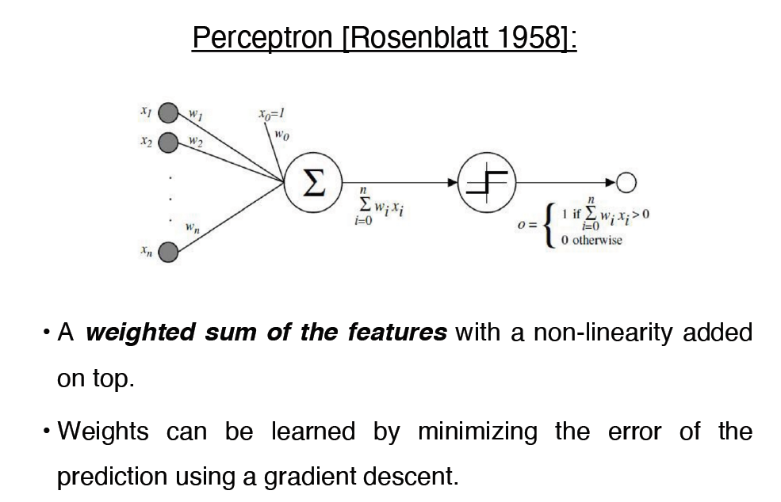

# Digital Image Processing, Regression and Classification

Author: GC

---

This is a Computer Vision project, which includes:

1. A suite of digital image processing tools:

   - Canny Edge Detection
   - Laplacian Blending
   - Homography and Image Stitching
   - Image Morphing
   - Poisson Image Blending/Editing

 

2. Implementation of a machine learning model for age prediction of digital images using Convolution Neural Network (CNN):

   - Linear regression
   - Linear perceptron
   - Classification

 

---

Instruction:

The source codes run on Google Colab. Please upload all the support documents into Google Drive root folder before running the codes.

---

## 1.1 Canny Edge Detection

This part is a technique demo for Canny edge detection of digital images, which includes 5 steps:

- Apply Gaussian filter to smooth the image in order to remove the noise.
- Find the intensity gradients of the image.
- Apply gradient magnitude thresholding or lower bound cut-off suppression to get rid of spurious response to edge detection.
- Apply double threshold to determine potential edges.
- Track edge by hysteresis: Finalize the detection of edges by suppressing all the other edges that are weak and not connected to strong edges.

---

## 1.2 Laplacian Blending

This part is a technique demo that seemlessly blend two or more images together using Gaussian and laplacian paramids of the images:

- Image reduce and expand operations.
- Calcualte Gaussian and Laplacian pyramids.
- Combine pyramids and blend images.

---

## 1.3 Homography and Image Stitching

This part is a technique demo for:

- Compute the homography between tow images when correspondces are known.
- Estimate correspondence between two sets of features points with ratio test and foreward and backward matching.
- Use RANSAC to find the best homography estimate from the estimated correspondences.

# 1.4 Image Morphing

This part focuses on image morphing techniques and specifically, image morphing
via triangulation.

- Define a triangular mesh over the feature points using Delaunay Triangulation.
- Using Barycentric Coordinates to match pixels of two images.
- Cross-dissolve the warped images

# 1.5 Poisson Image Blending/Editing

This part focuses on the gradient domain blending based on Poisson equation. The goal is to create a blended image that is partially cloned from
a (source) image.

- The key idea of the gradient domain blending is to apply the gradient of the source image to the target image’s replacement pixels, but keep other pixels.

---

## 2.1 Linear regression

This part implemented a linear regressor for age estimation. The
linear regressor is fed into a feature vector extracted from the given image and outputs a number indicating the age.

- Training data set: https:
  //github.com/yu4u/age-gender-estimation/tree/master/appa-real
- The feature extraction is implemented via a convolutional neural network (CNN).
- The methods implemented: the closed form solution, gradient descent and the stochastic gradient descent (SGD).

## 2.2 Linear perceptron

This part implemented the binary linear perceptron and test it on a emoji dataset to classify them.

- Linear perceptron uses the sign of a linear model to indicate the class of the input sample.
- Given a sample x, the output labels will be either 1 or -1.

## 2.3 Classification

This part uses the same data set as 2.1 linear regression, instead of regression, we treat the age prediciton as a classification process.

- We suppose that age is an integer between the range [1..100], so there are totally 101 classes.
- Implementation of the combination of softmax function and cross entropy loss.
- Migrated the model using PyTorch.

